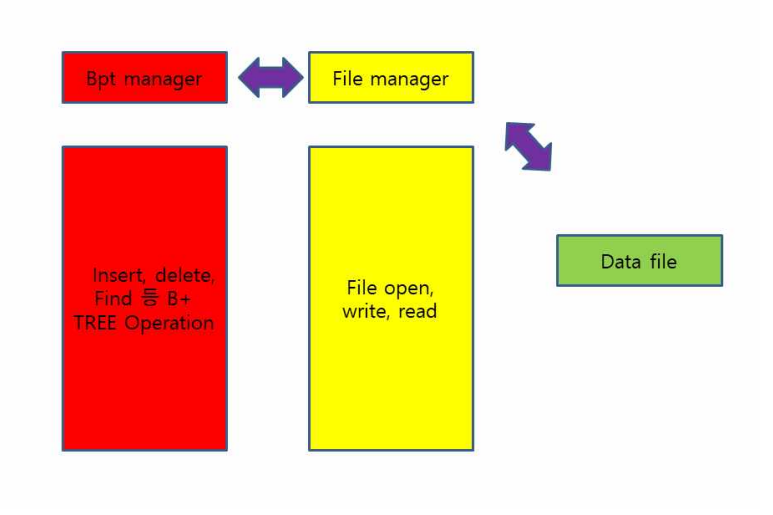
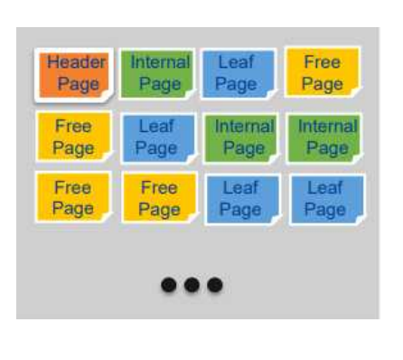

# Database-Management-System

## Overall Layered Architecture

Disk based B+ TREE는 disk 상에서 동작하는 b+ tree이다. b+ tree는 record의 효율적인 
insert, find, delete를 통해 정렬된 데이터를 표현하기 위한 트리자료구조의 일종이다.

가장 초기의 B+tree는 크게 두 개의 layer로 구성되어있다. Bpt manager와 File manager이
다. Bpt manager는 B+ Tree operation 에 해당하는 insert, delete, find 작업을 수행한다. File manager 는 File open, write, read 와 같은 file 관련 작업을 수행한다. 즉, Data file
에 대한 접근은 File manager를 통해서만 가능한 것이다. 아래에서는 데이터 파일의 구성
요소, Bpt manager와 File manager의 동작 방식을 보다 세부적으로 다룰 것이다. What's inside the data file?
데이터 파일은 4096 byte의 페이지들로 구성되어있다. 페이지는 header page, internal 
page, leaf page, free page 총 4개의 종류이다. 
header page : 데이터 파일에 가장 앞에 존재하며 metadata를 가지고 있다. metadata는 
Free page number, Root page number, Number of pages로 이루어져있다.
internal page: internal record를 저장하는 페이지이다. internal record는 leaf record의 위
치를 알려주는 역할을 한다. 
leaf page: 실질적으로 leaf record를 가지고 있는 페이지이다. free page: leaf page, internal page가 될 수 있는 공백의 페이지이다.

## HOW Bpt manager WORKS

● insert

find함수를 통해 해당 key를 가진 record가 존재하는지 판단한다. record가 존재할 경우, value만 업데이트 한다. 그렇지 않을 경우, 새로운 record를 insert 해야 하는데 아래의 3가
지 상황에 알맞게 동작해야한다.
1. 트리가 존재하지 않는 경우
2. 트리가 존재하고 insert될 공간이 있는 경우
3. 트리가 존재하고 insert될 공간이 없는 경우
1의 경우, 새로운 트리를 만든다. 2의 경우, leaf 노드에 record를 insert 해준다. 3의 경우, leaf 노드에 record를 insert 해주고 split 해준다. 그 후 internal 노드에 해당 
record를 insert해주고 마찬가지로 노드가 가득 찼을 경우, split 해준다. 이 과정은 root 노
드까지 일어난다. 

● delete

root에서 시작하여 key가 속한 leaf page를 찾는다. leaf page에서 key를 제거한다. leaf 
page의 key가 하나도 남지 않는 경우만 neighbor page와 merge가 일어난다. 다만 
neighbor page에 key가 가득 차 있는 경우, neighbor page의 capacity가 초과될 수도 있
기에 merge가 일어나지 않는다. merge가 일어났다면 leaf page 부모로부터 삭제된 페이지
를 가리키는 page_num을 삭제한다. 이러한 delete가 root까지 전파될 수 있다. 아래의 링크는 b+ tree에서 insert와 delete가 어떻게 일어나는지 시각적으로 보여준다. https://www.cs.usfca.edu/~galles/visualization/BPlusTree.html

위의 그림은 bpt manger와 data file이 어떻게 상호작용하는지 보여주는 좋은 예이다. bpt manager는 data file에서 page관한 정보를 읽고 insert, delete operation을 수행한다. 앞서 말했듯이 data file에 대한 접근은 file manager를 통해서만 가능하다. 
## How File manager works 

file manager는 data file과 bpt manager 사이 연결고리이다. bpt manager에서 생긴 변경
사항은 file manager를 통해 data file 에 반영된다. 기본적으로 file에 page를 읽고 쓰는 역할을 한다. 또한 데이터 파일에 free page를 여러 
개 할당하거나 할당된 free page 중 하나를 bpt manager에게 제공하기도 한다. 

## 초기의 disk based b+ tree 한계

1. file I/o 가 많아 성능이 안 좋다. file manager에서 I/o가 많아짐에 따라 속도는 매우 느려진다. 초기의 disk based b+ tree
는 페이제에 변경 사항이 생길 때마다 file I/o가 이루어진다. 다량의 insert/delete를 통해 
structure modification까지 일어날 경우, file I/o가 급증할 것이다. 이는 성능 감소의 주된 
원인이다. 이를 해결하기 위해 buffer manager가 필요하다. 
2. 여러 트랜잭션이 동시에 사용할 수 없다. 초기의 disk based b+ tree는 단일 사용자만을 허용한다. 다수의 트랜잭션이 동시에 사용
할 수 없다. 다수의 트랜잭션이 하나의 페이지에 접근하여 정보를 수정할 경우, 원치 않는 
결과가 출력될 것이다. ACID가 전혀 충족되지 않는 모델이다. 이는 transaction manager, 
log manger를 통해 해결되어야 한다. 

## HOW Buffer manager Works 

buffer manage은 file I/o를 최소화하기 위해 등장하였다. bpt manager와 file manger 사이
에 위치하며 빠른 I/o를 가능하게 한다. buffer는 in memory 상에서 존재하는 page의 집합
체이며 file I/o 보다 빠른 접근이 가능하다. 아래의 이점은 buffer manager가 DBMS에 가
져오는 이점들이다.

● write buffering -> file write를 직접적으로 하지 않고 buffer write한다. write가 빨리 이
루어지는 것 같은 효과를 준다. 

● caching read -> 해당 페이지에 대한 내용이 buffer에 있을 경우, file read가 일어나지 
않는다. read가 빨리 이루어지는 것 같은 효과를 준다.

init db, buffer read/write 등의 api를 제공하며 아래에서는 각 api의 동작원리에 대해 세부
적으로 다룰 것이다. 

## init db 
buffer를 초기화하는 작업이다. 이 과정에서 버퍼의 개수를 지정할 수 있다. 

## buffer read/write
페이지의 내용을 buffer를 통해 read/write하는 것이다. 이때 페이지의 내용을 어떤 buffer
에 적어야 하는지 생각해보아야 한다. 해당 페이지에 이미 buffer가 배당되어 있다면 그 
buffer에 페이지의 내용을 적으면 된다. 해당 페이지에 배당된 buffer가 없다면 LRU policy
에 근거하여 buffer를 배당해야 한다. LRU policy와 관련된 이야기는 뒤에서 세부적으로 다
룰 것이다. 

## Buffer manager issue: LRU policy 
LRU policy 의 기본원칙은 가장 사용한지 오래된 버퍼를 제공하는 것이다. 제공하는 버퍼가 
다른 operation을 통해 아직 사용하고 있으면 안 된다. 그렇기에 버퍼를 사용하고 있을 경
우에는 set_pin을 하고 그렇지 않을 경우 unset_pin을 한다. 만일 제공해야할 버퍼가 
pinned되어 있다면 그 다음 버퍼를 제공해야 한다.

# Concurrency Control Implementation
## Why is concurrency control needed?

concurrency control 이루어지지 않는 DBMS에서는 사용자에게 이상한 결과가 발생할 수 
있다. 

Lost Update: 두 번째 트랜잭션이 첫 번째 트랜잭션이 변경한 record값을 곧바로 변경하면 
첫 번째 트랜잭션의 update가 사라진다. 

Inconsistent Reads: 하나의 트랜잭션이 동일한 record에 대해 두 번 read를 하였을 때, read된 record의 값이 다른 것을 의미한다. 

Dirty Reads: 트랜잭션이 나중에 abort된 트랜잭션에 의해 쓰인 값을 읽는다. 

DBMS 트랜잭션들이 안정적으로 수행된다는 것을 보장하기 위한 성질 ACID 중 CI 에 해당
하는 내용이다.

C: 트랜잭션이 실행을 성공적으로 완료하면 언제나 일관성 있는 데이터베이스 상태로 유지
하는 것을 의미한다.

I: 트랜잭션을 수행 시 다른 트랜잭션의 연산 작업이 끼어들지 못하도록 보장하는 것. 즉, 트랜잭션 밖에 있는 어떤 연산도 중간 단계의 데이터를 볼 수 없음을 의미한다.

## how transaction manager works 
record에 대한 lock은 lock table을 통해 이루어진다. lock table은 여러 thread의 lock 
object를 직접 관리하는 모듈이다. 특정 record에 접근하는 lock object를 대기시킬지 진행
시킬지 결정한다. 여러 thread에서 하나의 record에 동시에 변경할 경우, 모든 변경사항이 
이행되지 않을 수 있다. 이러한 상황을 피하고 atomic하게 진행하기 위해 lock table이 필
요하다.

buffer_maager_latch를 획득한 후에만, page latch를 획득하거나 LRU double linked list를 
변경할 수 있게 하였다. 다수의 트랜잭션이 동시에 buffer에 접근하는 와중에 buffer를 
critical section으로 보호하기 위해서이다. 즉, isolation을 유지하기 위해서이다. 루트에서 리프까지 탐색하는 과정에서 buffer에서 page를 읽을 때, buffer_manager_latch를 
먼저 획득하고 page_latch를 획득한다. page_latch를 획득한 후에는 buffer_manager_latch
를 해제한다. 그리고선 page에서 원하는 정보를 얻고 page_latch를 해제한다. 해당 순서를 
지키지 않을 경우, deadlock문제가 발생할 수 있다.

concurrency control method는 Strict Two Phase Locking을 사용하였다. Two Phase 
Locking과 대게 유사하다. Two Phase Locking은 serializability을 보장하지만 Cascading 
Aborts문제가 발생한다. 이는 하나의 트랜잭션이 commit 될 때 해당 트랜잭션이 가진 lock
들을 동시에 release하면서 해결할 수 있다.

# Crash-Recovery Implementation
## why is crash-recovery implementation needed?

DBMS 트랜잭션들이 안정적으로 수행된다는 것을 보장하기 위한 성질 ACID 중 AD에 해당
하는 내용이다. 

A: 트랜잭션과 관련된 작업들이 모두 수행되었는지 아니면, 모두 실행이 안되었는지를 보장
하는 능력. 

D: DBMS가 사용자에게 트랜잭션 커밋(commit) 응답을 했을 경우, 해당 트랜잭션의 커밋은 
보장 되어야 한다는 속성. 

crash-recovery는 A와 D를 안정적으로 수행하는 것을 도와준다. 

## how crash-recovery manager works 

log는 log buf에 저장되어 있다가 WAL에 의해 commit, flush 작업 전에 log disk에 적힐 
것이다. log는 begin, commit, rollback, update, compensate로 총 5개의 종류가 있다. 기본적으로 three pass recovery를 지원하며 three pass는 Analysis pass – Redo pass – Undo pass를 의미한다. 

### Analysis pass 

Analysis 단계에서는 트랜잭션을 winner와 loser로 나누었다. 그 기준은 commit 이나 abort 
log의 유무였다. commit이나 abort log가 기록되어있으면 winner로 없으면 loser로 나누었
다.

### Redo pass 

Redo 단계에서는 winner의 update 와 compensate 작업을 이행하는 것이 목표이다. 그래
서 winner을 update, compensate log를 보고 new_data에 해당하는 값으로 갱신하는 작업
을 하였다. page의 seq no이 log의 seq no보다 크다면 이미 page에는 값이 갱신된 것으
로 간주하고 skip 하였다. 이는 consider log에 관한 내용이며 recovery 도중 crash가 발생
했을 때, 빠른 recovery를 위한 것이다. 
### Undo pass

Undo 단계에서는 loser의 update 와 compensate를 무효화 하는 것이 목적이다. 그래서 
loser을 update, compensate log를 보고 old_data에 해당하는 값으로 갱신하는 작업을 하
였다.